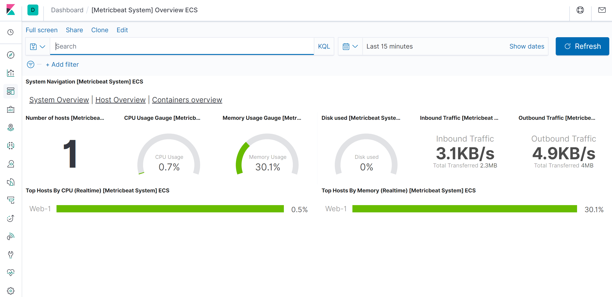
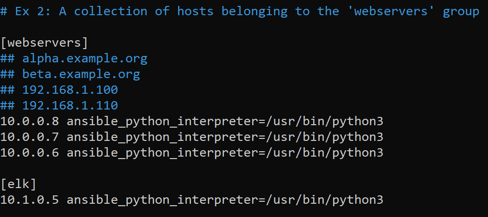

# ELK-Stack
## Automated ELK Stack Deployment

This repository documents files, images, and instructions used in configuring the below network:

Successful instances of ELK deployment from these files have been used and tested with Azure. You may recreate this network deployment. Otherwise, you may install an individual piece, such as metricbeat:

[metricbeat-playbook.yml](Ansible/ansible_playbooks/metricbeat-playbook.yml)

This outline contains:
- A description of the network Topology
- Access policies
- ELK Configuration
  - Beats in use
  - Monitored machines
- Instructions for using the Ansible Build

### Description of the Topology

The configured network exposes a load-balanced, carefully monitored DVWA (D*** Vulnerable Web Application) instance. 
Load balancing ensures a secure application by: 
- Protecting against DDOS (distributed denial of service) attacks
- Optimizing traffic through even load distribution
- Improving user experience
- Protecting network availability

A jump-box may be used in addition to a load balancer, to add an additional layer of security. The jump-box does this by acting as a single point of entry when connecting to the internet. 

This network is protected further by use of an SSH key, when connecting to the jump-box server. Connecting to through SSH provides a simple and secure access point to your server. 

These precautions decrease surface attack area and protect network availability.

An integrated ELK server assists in easily monitoring vulnerable VMs (virtual machines) for changes  to logs and system applications. As an analytics tool, ELK Stack aggregates data in a simple form and allows analysts to collect logs from several machines, into a single database. Analysts can quickly execute complex searches.

Filebeat is used to monitor log files.
Metricbeat collects and records data regarding the metrics of a system or service.

Machine configurations:

| Name       	| Function          	| IP Address                               	| Operating System 	|
|------------	|-------------------	|------------------------------------------	|------------------	|
| Jump Box   	| Gateway           	| Public: REDACTED Private: REDACTED	| Linux            	|
| ELK-1      	| Monitor/Analytics 	| Public: REDACTED Private: REDACTED 	| Linux            	|
| Web-1      	| Web server        	| Public: N/A Private: 10.0.0.7            	| Linux            	|
| Web-2      	| Web server        	| Public: N/A Private: 10.0.0.6            	| Linux            	|
| Web-3      	| Web server        	| Public: N/A Private: 10.0.0.8            	| Linux            	|
| Pentest-LB 	| Load Balancer     	| Public: REDACTED Private: N/A        	| N/A              	|

### Access Policies
Machines created within the internal network have not been exposed to the public Internet.

In this configuration, only the Jump Box machine is able to accept Internet connections. Machine access is only allowed from the creator's host machine public IP address.   

Machines within the network can only be accessed by the Jump Box Provisioner.
ELK-1 may only be accessed through the Jump Box with SSH or through the host machine public IP with TCP over port 5601.

Access policies:

| Name     	| Publicly Accessible 	| Allowed IP Addresses               	|
|----------	|---------------------	|------------------------------------	|
| Jump Box 	| Yes - SSH           	| Host Machine Personal IP           	|
| ELK-1    	| Yes - HTTP          	| Host Machine Personal IP, REDACTED 	|
| Web-1    	| No                  	| 10.0.0.6, 10.0.0.8, REDACTED       	|
| Web-2    	| No                  	| 10.0.0.7, 10.0.0.8, REDACTED       	|
| Web-3    	| No                  	| 10.0.0.7, 10.0.0.6, REDACTED       	|

### Elk Configuration
ELK machine configuration was automated through Ansible. Automation is advantageous, as this allows for consistent and quick deployment across multiple machines. 

The playbook includes the tasks to: 
- Configure the VM to use more memory
- Install docker.io and python3-pip
- Configure the container to start with port mappings: 5601, 9200, 5044
- Launch the docker service on boot

An image displaying the results of running `docker ps` after successful ELK configuration:

### Target machines & beats
The ELK server is configured to monitor the following machines:
- 10.0.0.6
- 10.0.0.7
- 10.0.0.8 

We have installed the following Beats on these machines:
- Filebeat
- Metricbeat

Beats allow us to collect information from each machine.

FILEBEAT: Collects log files such as those generated by Apache, Microsoft Azure tools, or MySQL databases. 
- Syslog beats collect and aggregate data for system logs and event messages that are sent to the syslog server.
- Below is an example of monitoring Syslogs, or System Logging Protocol, through Filebeat:

METRICBEAT: Collects and allows the aggregation of metrics from an operating system and the services running on the server. 
- Below is an example of monitoring System metrics such as CPU, memory, and network through Metricbeat:

### Using the Playbook
The Ansible control node must already be properly configured in order to use the playbook. Assuming the control node is provisioned, you may take the following steps to run the Playbook: 

1. SSH into the control node
2. Copy the playbook files to the Ansible container: /etc/ansible/roles/install-elk.yml
3. Add your the IP of your VM to the Ansible hosts file: /etc/ansible/hosts
4. In the same hosts file, specify the the groups that will be included in the playbook:
4#. 
5. Run the playbook, and navigate to command line to SSH into the ELK server to check that the installation worked as expected.
6. Navigate to your Kibana in your web browser with the following syntax: http://ELK_Public_IP:5601/app/kibana 

### Playbook summary
Playbook: [install-elk.yml](Ansible/ansible_playbooks/install-elk.yml)
Copied to: etc/ansible/roles/install-elk.yml

Update the hosts file in etc/ansible/hosts to make Ansible run the playbook on a specified machine. Separate machines into 2 groups to distinguish between the machines that will be used for your ELK server deployment, and Filebeat installation.
- Test ELK server availability at: http://52.184.224.203:5601/app/kibana or http://ELK_Public_IP:5601/app/kibana 

## Running the Playbooks
### ELK
- Download the Playbook: 
  - curl https://raw.githubusercontent.com/dorianeSF/ELK-Stack-Project/main/Ansible/ansible_playbooks/install-elk.yml > /etc/ansible/roles/install-elk.yml
- Edit the Playbook: 
  - nano /etc/ansible/roles/install-elk.yml
- Configure Ansible's inventory in the hosts file: 
  - nano /etc/ansible/hosts
- Run the Playbook to launch the container: 
  - ansible-playbook install-elk.yml

### Filebeat
- Download the Playbook: 
  - curl https://raw.githubusercontent.com/dorianeSF/ELK-Stack-Project/main/Ansible/ansible_playbooks/filebeat-playbook.yml > /etc/ansible/roles/filebeat-playbook.yml
- Edit the Playbook: 
  - nano /etc/ansible/roles/filebeat-playbook.yml
- Download the config file: 
  - curl https://raw.githubusercontent.com/dorianeSF/ELK-Stack-Project/main/Ansible/config_files/filebeat-config.yml > /etc/ansible/files/filebeat-config.yml
- Edit the config file: nano /etc/ansible/files/filebeat-config.yml
  - Under "output.elasticsearch:" enter your ELK Public IP in place of the hosts IP
- Run the Playbook: 
  - ansible-plabook filebeat-playbook.yml

### Metricbeat
- Download the Playbook: 
  - curl https://raw.githubusercontent.com/dorianeSF/ELK-Stack-Project/main/Ansible/ansible_playbooks/metricbeat-playbook.yml > /etc/ansible/roles/metricbeat-playbook.yml
- Edit the Playbook: 
  - nano /etc/ansible/roles/metricbeat-playbook.yml
- Download the config file: 
  - curl https://raw.githubusercontent.com/dorianeSF/ELK-Stack-Project/main/Ansible/config_files/metricbeat-config.yml > /etc/ansible/files/metricbeat-config.yml
- Edit the config file: nano /etc/ansible/files/metricbeat-config.yml
  - Under "output.elasticsearch:" enter your ELK Public IP in place of the hosts IP
- Run the Playbook: 
  - ansible-playbook metricbeat-playbook.yml
