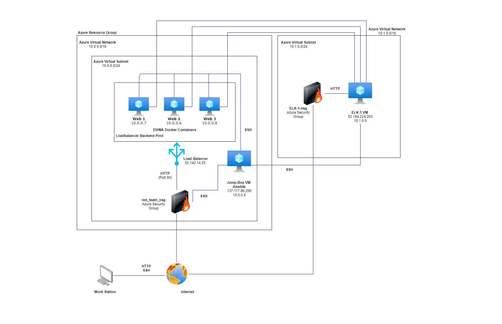
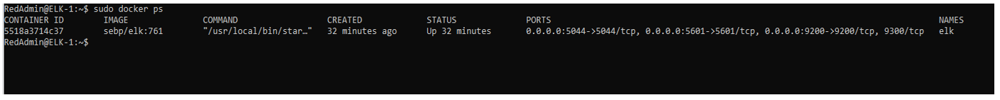
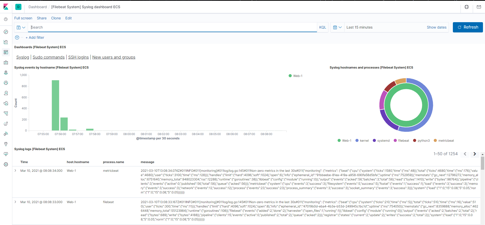

# ELK-Stack
## Automated ELK Stack Deployment

This repository is home to the files, images, and instructions used to configure the below network:

The successful ELK deployment from these files have been used and tested on Azure. If you would like to recreate the entire deployment of this network, you may do so. Otherwise, you may install an individual piece, such as metricbeat:

Ansible/metricbeat-playbook.yml

The document which you are reading contains the the following elements:
- A description of the network Topology
- Access Policies
- ELK Configuration
  - Beats in use
  - Machines that are monitored
- Instructions to use the Ansible Build

### Description of the Topology

The purpose of the configured network is to expose a load-balanced and carefully monitored DVWA (D*mn Vulnerable Web Application) instance.
The use of load balancing ensures a secure application by protecting against distributed denial-of-service (DDoS) attacks, while optimizing traffic through an even load distribution, improving user experience.
Load balancing protects the availability of a network. Using a jump-box in addition to a load balancer adds an additional layer of security by acting as a single point of entry when connecting to the internet.  
Our network is protected further by the use of an SSH Key when connecting to the jump-box server. Connecting to your jump-box through SSH provides a simple and secure access point to your server. 
Overall, these precautions decrease your surface attack area and protect your network's availability.

Integrating an ELK server assists users in easily monitoring vulnerable VMs for changes to the logs and system applications. As an analytics tool, ELK Stack aggregates data in a simple form. In addition, ELK stack allows analysts to collect logs from several machines into a single database and quickly execute complex searches.
- Filebeat is used to monitor the log files
- Metricbeat collects and records data regarding the metrics of a system or service. 

Please see below for the configuration details of each machine:
| Name       	| Function          	| IP Address                               	| Operating System 	|
|------------	|-------------------	|------------------------------------------	|------------------	|
| Jump Box   	| Gateway           	| Public: 137.117.96.250 Private: 10.0.0.4 	| Linux            	|
| ELK-1      	| Monitor/Analytics 	| Public: 52.184.224.203 Private: 10.1.0.5 	| Linux            	|
| Web-1      	| Web server        	| Public: N/A Private: 10.0.0.7            	| Linux            	|
| Web-2      	| Web server        	| Public: N/A Private: 10.0.0.6            	| Linux            	|
| Web-3      	| Web server        	| Public: N/A Private: 10.0.0.8            	| Linux            	|
| Pentest-LB 	| Load Balancer     	| Public: 52.142.14.25 Private: N/A        	| N/A              	|

### Access Policies
The machines created within the internal network have not been exposed to the public Internet.

With this configuration, only the Jump Box machine is able to accept Internet connections. Therefore, access to this machine is only allowed from my host machine's public IP address.   

Machines within the network can only be accessed by the Jump Box Provisioner.
ELK-1 may only be accessed through the Jump Box with SSH or through my host machine's public IP with TCP on port 5601.

A summary of the access policies in place can be found in the table below.

| Name     	| Publicly Accessible 	| Allowed IP Addresses               	|
|----------	|---------------------	|------------------------------------	|
| Jump Box 	| Yes - SSH           	| Host Machine Personal IP           	|
| ELK-1    	| Yes - HTTP          	| Host Machine Personal IP, 10.0.0.4 	|
| Web-1    	| No                  	| 10.0.0.6, 10.0.0.8, 10.0.0.4       	|
| Web-2    	| No                  	| 10.0.0.7, 10.0.0.8, 10.0.0.4       	|
| Web-3    	| No                  	| 10.0.0.7, 10.0.0.6, 10.0.0.4       	|

### Elk Configuration
The configuration of the ELK machine was automated through Ansible. The lack of manual configuration is advantageous since this allows for consistent and quick deployment across multiple machines. 

The playbook implements the following tasks:
- Configures the VM to use more memory
- Installs docker.io and python3-pip
- Configures the container to start with port mappings: 5601, 9200, 5044
- Launches the docker service on boot

The following screenshot displays the result of running `docker ps` after successfully configuring the ELK instance.

### Target Machines & Beats
The ELK server is configured to monitor the following machines:
- 10.0.0.6
- 10.0.0.7
- 10.0.0.8 

We have installed the following Beats on these machines:
- Filebeat
- Metricbeat

These Beats allow us to collect the following information from each machine:
- Filebeat collects log files such as those generated by Apache, Microsoft Azure tools, or MySQL databases. 
- Below is an example of monitoring Syslogs, or System Logging Protocol, through Filebeat:

- Syslog beats collect and aggregate data for system  logs and event messages that are sent to the syslog server.
- Metricbeat...
- Below is an example of...
![Metricbeat system example] (Images/DorianeF_Metricbeat_System_Example.png)
### Using the Playbook
In order to use the playbook, you will need to have an Ansible control node already configured. Assuming you have such a control node provisioned: 

SSH into the control node and follow the steps below:
- Copy the _____ file to _____.
- Update the _____ file to include...
- Run the playbook, and navigate to ____ to check that the installation worked as expected.

_TODO: Answer the following questions to fill in the blanks:_
- _Which file is the playbook? Where do you copy it?_
- _Which file do you update to make Ansible run the playbook on a specific machine? How do I specify which machine to install the ELK server on versus which to install Filebeat on?_
- _Which URL do you navigate to in order to check that the ELK server is running?

_As a **Bonus**, provide the specific commands the user will need to run to download the playbook, update the files, etc._
SAMPLE URL:  [Markdown Table Generator](http://www.tablesgenerator.com/markdown_tables)
